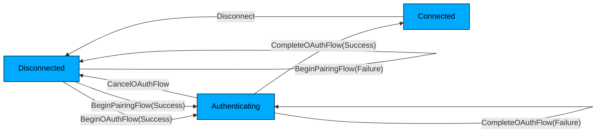
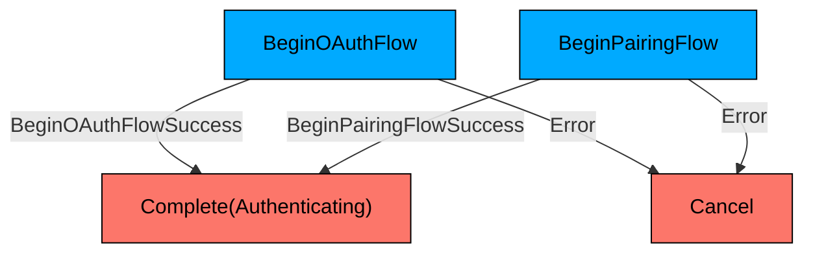
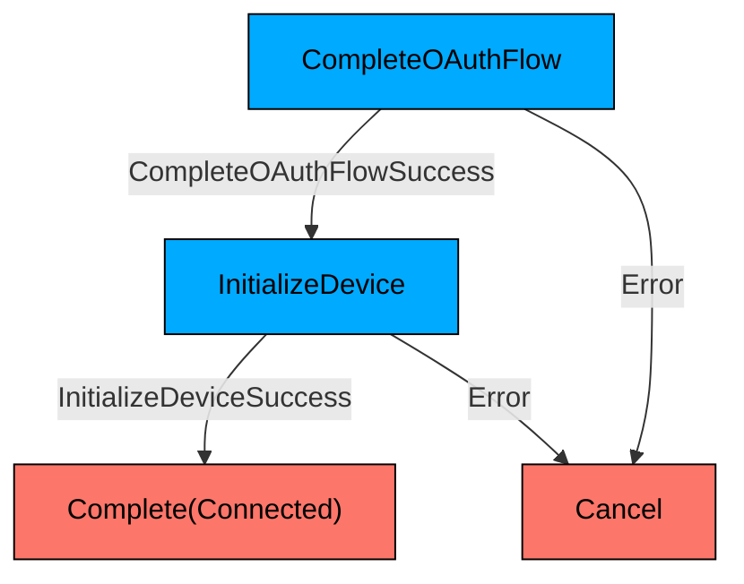
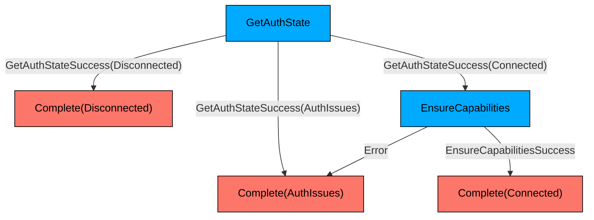

# The Public FxA State Machine

The public FxA state machine tracks a user's authentication state as they perform operations on their account.
The state machine, its states, and its events are visible to the consumer applications.
Applications generally track the state and update the UI based on it, for example providing a login button for the `Disconnected` state and link to the FxA account management page for the `Connected` state.

The public state machine events correspond to user actions, for example clicking the login button or completing the OAuth flow.
The public state machine is non-deterministic -- from a given state and event, there are multiple possibilities for the next state.
Usually there are two possible transitions: one for a successful operation and one for a failed one.
For example, when completing an oauth flow, if the operation is successful the state machine transitions to the `Connected` state, while if it fails it stays in the `Authenticating` state.

Here is an overview containing some of the states and transitions:

# The Internal State Machines

For each public state, we also define an internal state machine that represents the process of transitioning out of that state.
Internal state machine states correspond to `FirefoxAccount` method calls and events correspond to call results.
Unlike the public state machine, the internal state machines are deterministic meaning that each `(state, event)` pair always results in the same next state.

There are two terminal states for the internal state machines:
  - `Complete(new_state)`: Complete the process and transition the public state machine to a new state
  - `Cancel`: Cancel the process and don't change the current public state.

Here are some example internal state machines:

## Disconnected

## Authenticating

## Uninitialized

This is the initial state for the public state machine (not shown in the diagram above).

