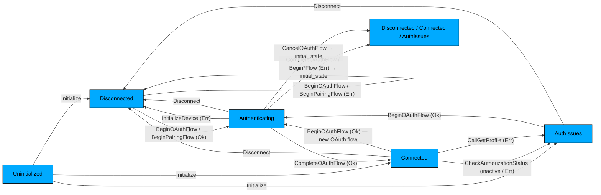

# The FxA State Machine

The FxA state machine tracks a user's authentication state as they perform operations on their account.
The state machine, its states, and its events are visible to consumer applications (Firefox iOS, Firefox Android).
Apps generally watch the state and update the UI based on it - e.g. showing a login button for `Disconnected`, or a link to the FxA account management page for `Connected`.

Events correspond to user actions or runtime triggers (clicking the login button, completing OAuth, recovering from an auth error). From a given state and event, the FSM may produce multiple possible next states depending on the result of underlying network calls, usually one for success and one for failure.

For example, when completing an OAuth flow: a successful `CompleteOAuthFlow` transitions from `Authenticating` to `Connected`; a failed one transitions back to the state we were authenticating from.

## High-level

There are two layers:

1. **`transitions.rs`** — Each `match` arm reads as: do the work (calling methods on the `RetryingAccount` wrapper), attach the target state for the error path with `.to_state_machine_err(|| target)?`, return the success state. Returns `Result<FxaState, StateMachineErr>`, the `Err` variant carries both the error cause (for logging) and the target state to land in.
2. **`helpers.rs`** — the supporting types:
   - [`RetryingAccount`] wraps a `&mut FirefoxAccount` and exposes only the methods the FSM uses, with retry policy applied automatically. Holding a `&mut RetryingAccount` instead of a `&mut FirefoxAccount` makes it hard to call a network method without retry.
   - [`StateMachineErr`] + [`ResultExt::to_state_machine_err()`] extension trait give the `?` ergonomics for "on error, transition to this state".
   - [`RetryPolicy`] holds the network-retry count and auth-recovery flag.

The driver in `mod.rs` validates the `Initialize` invariant, builds a `RetryingAccount`, calls `transition()` once, routes the error (if any) through `convert_log_report_error` for logging/Sentry, commits the new state, and fires `on_auth_issues()` if applicable.

Adding a new event is straightforward: add a `match` arm in `transition()`. If the event needs a new account method, add a one-line wrapper to `RetryingAccount` — that's the moment to think about retry semantics for the new operation.

## State diagram

```mermaid
graph LR;
    Uninitialized -->|"Initialize"| Disconnected
    Uninitialized -->|"Initialize"| Connected
    Uninitialized -->|"Initialize"| AuthIssues
    Disconnected -->|"BeginOAuthFlow / BeginPairingFlow (Ok)"| Authenticating
    Disconnected -->|"BeginOAuthFlow / BeginPairingFlow (Err)"| Disconnected
    Authenticating -->|"CompleteOAuthFlow (Ok)"| Connected
    Authenticating -->|"CompleteOAuthFlow / Begin*Flow (Err) → initial_state"| InitialState[Disconnected / Connected / AuthIssues]
    Authenticating -->|"CancelOAuthFlow → initial_state"| InitialState
    Authenticating -->|"InitializeDevice (Err)"| Disconnected
    Authenticating -->|"Disconnect"| Disconnected
    Connected -->|"Disconnect"| Disconnected
    Connected -->|"BeginOAuthFlow (Ok) — new OAuth flow"| Authenticating
    Connected -->|"CheckAuthorizationStatus (inactive / Err)"| AuthIssues
    Connected -->|"CallGetProfile (Err)"| AuthIssues
    AuthIssues -->|"BeginOAuthFlow (Ok)"| Authenticating
    AuthIssues -->|"Disconnect"| Disconnected

    classDef default fill:#0af, color:black, stroke:black
```

`Authenticating { initial_state }` tracks where the user came from. Error and cancel paths from `Authenticating` return to `initial_state.into()` (not always `Disconnected`) — so a re-auth attempt from `AuthIssues` that the user cancels lands back at `AuthIssues`, and an OAuth flow started from `Connected` that errors out keeps the user at `Connected`. The exception is `InitializeDevice` errors, which always land at `Disconnected`. A `CompleteOAuthFlow` success from `Authenticating { initial_state: Connected }` skips `InitializeDevice` because the device is already initialized.

## Retry behavior

`RetryingAccount` applies this policy:

- **Network errors** retry up to 3 times.
- **Auth errors** trigger a single recovery attempt: clear the access token cache, call `check_authorization_status`, and (if still active) retry the operation once.

Methods that auto-recover from auth errors: `complete_oauth_flow`, `begin_oauth_flow`, `begin_pairing_flow`, `get_profile`. Methods that don't (auth errors are FSM-recoverable, not operation-recoverable): `initialize_device`, `ensure_capabilities`, `check_authorization_status`. The `EnsureDeviceCapabilities` auth-error case is handled at the FSM level — the transition arm matches on the error and dispatches to `CheckAuthorizationStatus`.
