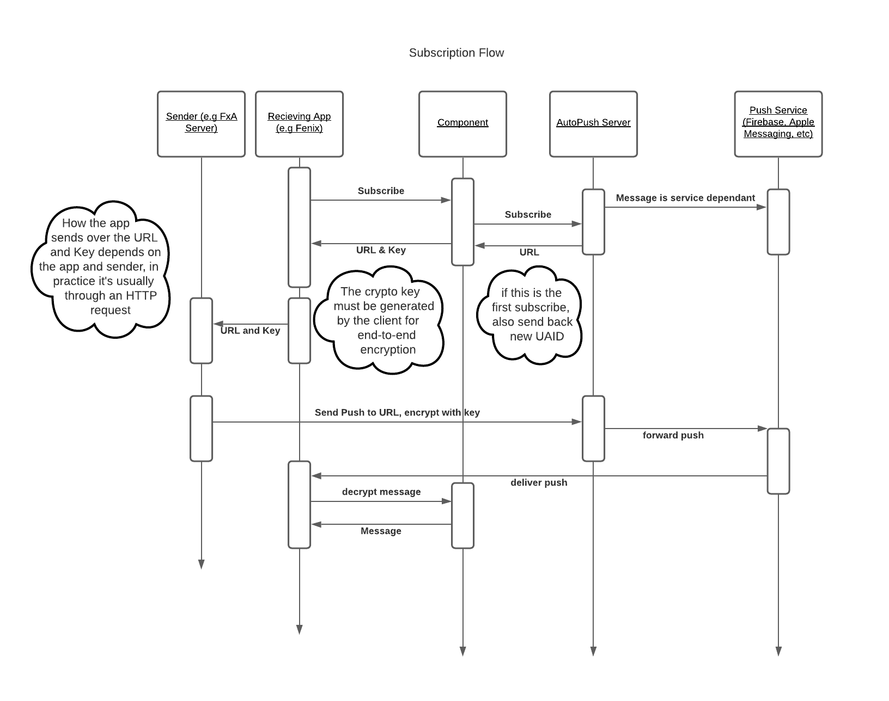

# Rust Push Component

This component helps an application to manage [WebPush](https://developer.mozilla.org/en-US/docs/Web/API/Push_API) subscriptions,
acting as an intermediary between Mozilla's [autopush service](https://autopush.readthedocs.io/en/latest/)
and platform native push infrastructure such as [Firebase Cloud Messaging](https://firebase.google.com/docs/cloud-messaging) or [Amazon Device Messaging](https://developer.amazon.com/docs/adm/overview.html).

## Background Concepts

### WebPush Subscriptions

A WebPush client manages a number of *subscriptions*, each of which is used to deliver push
notifications to a different part of the app. For example, a web browser might manage a separate
subscription for each website that has registered a [service worker](https://developer.mozilla.org/en-US/docs/Web/API/Service_Worker_API), and an application that includes Firefox Accounts would manage
a dedicated subscription on which to receive account state updates.

Each subscription is identified by a unique *channel id*, which is a randomly-generated identifier.
It's the responsibility of the application to know how to map a channel id to an appropriate function
in the app to receive push notifications. Subscriptions also have an associated *scope* which is something
to do which service workers that your humble author doesn't really understand :-/.

When a subscription is created for a channel id, we allocate *subscription info* consisting of:

* An HTTP endpoint URL at which push messages can be submitted.
* A cryptographic key and authentication secret with which push messages can be encrypted.

This subscription info is distributed to other services that want to send push messages to
the application.

The HTTP endpoint is provided by Mozilla's [autopush service](https://autopush.readthedocs.io/en/latest/),
and we use the [rust-ece](https://github.com/mozilla/rust-ece) to manage encryption with the cryptographic keys.

Here's a helpful diagram of how the *subscription* flow works at a high level across the moving parts:


### AutoPush Bridging

Our target consumer platforms each have their own proprietary push-notification infrastructure,
such as [Firebase Cloud Messaging](https://firebase.google.com/docs/cloud-messaging) for Android
and the [Apple Push Notification Service](https://developer.apple.com/notifications/) for iOS.
Mozilla's [autopush service](https://autopush.readthedocs.io/en/latest/) provides a bridge between
these different mechanisms and the WebPush standard so that they can be used with a consistent
interface.

This component acts a client of the [Push Service Bridge HTTP Interface](https://autopush.readthedocs.io/en/latest/http.html#push-service-bridge-http-interface).

We assume two things about the consuming application:
* It has registered with the autopush service and received a unique `app_id` identifying this registration.
* It has registered with whatever platform-specific notification infrastructure is appropriate, and is
  able to obtain a `registration_id` corresponding to its native push notification state.

On first use, this component will register itself as an *application instance* with the autopush service, providing the `app_id` and `token` and receiving a unique `uaid` ("user-agent id") to identify its
connection to the server.

As the application adds or removes subscriptions using the API of this component, it will:
* Manage a local database of subscriptions and the corresponding cryptographic material.
* Make corresponding HTTP API calls to update the state associated with its `uaid` on the autopush server.

Periodically, the application should call a special `verify_connection` method to check whether
the state on the autopush server matches the local state and take any corrective action if it
differs.

For local development and debugging, it is possible to run a local instance of the autopush
bridge service; see [this google doc](https://docs.google.com/document/d/18L_g2hIj_1mncF978A_SHXN4udDQLut5P_ZHYZEwGP8) for details.

## API

## Initialization

Calls are handled by the `PushManager`, which provides a handle for future calls.

example:
```kotlin

import mozilla.appservices.push.(PushManager, BridgeTypes)

// The following are mock calls for fetching application level configuration options.
// "SenderID" is the native OS push message application identifier. See Native
// messaging documentation for details.
val sender_id = SystemConfigurationOptions.get("SenderID")

// The "bridge type" is the identifier for the native OS push message system.
// (e.g. FCM for Google Firebase Cloud Messaging, ADM for Amazon Direct Messaging,
// etc.)
val bridge_type = BridgeTypes.FCM

// The "registration_id" is the native OS push message user registration number.
// Native push message registration usually happens at application start, and returns
// an opaque user identifier string. See Native messaging documentation for details.
val registration_id = NativeMessagingSystem.register(sender_id)

val push_manager = PushManager(
    sender_id,
    bridge_type,
    registration_id
)

// It is strongly encouraged that the connection is verified at least once a day.
// This will ensure that the server and UA have matching information regarding
// subscriptions. This call usually returns quickly, but may take longer if the
// UA has a large number of subscriptions and things have fallen out of sync.

for change in push_manager.verify_connection() {
    // fetch the subscriber from storage using the change[0] and
    // notify them with a `pushsubscriptionchange` message containing the new
    // endpoint change[1]
}

```

## New subscription

Before messages can be delivered, a new subscription must be requested. The subscription info block contains all the information a remote subscription provider service will need to encrypt and transmit a message to this user agent.

example:
```kotlin

// Each new request must have a unique "channel" identifier. This channel helps
// later identify recipients and aid in routing. A ChannelID is a UUID4 value.
// the "scope" is the ServiceWorkerRegistration scope. This will be used
// later for push notification management.
val channelID = GUID.randomUUID()

val subscription_info = push_manager.subscribe(channelID, endpoint_scope)

// the published subscription info has the following JSON format:
// {"endpoint": subscription_info.endpoint,
//  "keys": {
//      "auth": subscription_info.keys.auth,
//      "p256dh": subscription_info.keys.p256dh
//  }}
```

## End a subscription

A user may decide to no longer receive a given subscription. To remove a given subscription, pass the associated channelID

```kotlin
push_manager.unsubscribe(channelID)  // Terminate a single subscription
```

If the user wishes to terminate all subscriptions, send and empty string for channelID

```kotlin
push_manager.unsubscribe("")        // Terminate all subscriptions for a user
```

If this function returns `false` the subsequent `verify_connection` may result in new channel endpoints.

## Decrypt an incoming subscription message

An incoming subscription body will contain a number of metadata elements along with the body of the message. Due to platform differences, how that metadata is provided may vary, however the most common form is that the messages "payload" looks like.

```javascript
{"chid": "...",         // ChannelID
 "con": "...",          // Encoding form
 "enc": "...",          // Optional encryption header
 "crypto-key": "...",   // Optional crypto key header
 "body": "...",         // Encrypted message body
}
```
These fields may be included as a sub-hash, or may be intermingled with other data fields. If you have doubts or concerns, please contact the Application Services team for guidance.

Based on the above payload, an example call might look like:

```kotlin
    val result = manager.decrypt(
        channelID = payload["chid"].toString(),
        body = payload["body"].toString(),
        encoding = payload["con"].toString(),
        salt = payload.getOrElse("enc", "").toString(),
        dh = payload.getOrElse("dh", "").toString()
    )
    // result returns a byte array. You may need to convert to a string
    return result.toString(Charset.forName("UTF-8"))
```

## Testing
### Android

Local builds of Fenix will not have Firebase enabled because there are keys that need to be
kept somewhat secret. However, it is possible to arrange.

* Ask someone from the Fenix team for a copy of `fenix_firebase.xml` - it will look something
  like

```
<resources>
    <string name="default_web_client_id" translatable="false">redacted</string>
    <string name="firebase_database_url" translatable="false">redacted</string>
    etc
</resources>

```

* Put it in your Fenix checkout in the `app/src/debug/res/values/` directory.

* Disable "strict mode" for main-thread IO, which in practice means a
  [commenting out this line](https://github.com/mozilla-mobile/fenix/blob/b9b1e984b5eb338aa61c2ebfa331eafa8cfac09b/app/src/main/java/org/mozilla/fenix/FenixApplication.kt#L172)

And that's it - you should now be able to get FCM tokens and thus have push work. Note that this
works on both emulators and devices.
