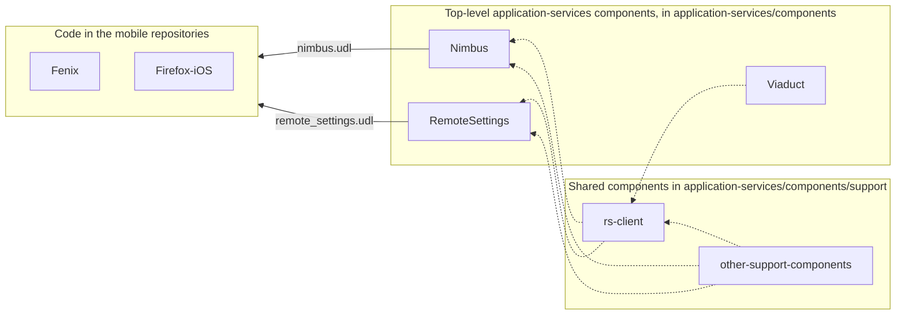

# A remote-settings client for our mobile browsers.

* Status: proposed
* Discussion: https://github.com/mozilla/application-services/pull/5302
* Deciders:
    * csadilek for the mobile teams ✔️
    * leplatrem for the remote-settings team ✔️
    * mhammond for the application-services team ✔️

* Date: 2022-12-16

## Context and Problem Statement

Mozilla’s mobile browsers have a requirement to access the remote settings service, but currently lack any libraries or tools which are suitable without some work.
A concrete use case is the management of search engine configurations, which are stored in Remote Settings for Firefox Desktop, but shipped as individual files on our mobile browsers, requiring application releases for all changes.

A constraint on any proposed solutions is that this work will be performed by Mozilla's mobile team, who have limited experience with Rust, and that it is required to be completed in Q1 2023.

This document identifies the requirements, then identifies tools which already exist and are close to being suitable, then identifies all available options we can take, and outlines our decision.

## Requirements
The requirements are for a library which is able to access Mozilla’s Remote Settings service and return the results to our mobile browsers.
This list of requirements is not exhaustive, but instead focuses on the requirements which will drive our decision making process.
As such, it identifies the non-requirements first.

### Non-requirements
The following items all may have some degree of desirability, but they are not hard requirements for the initial version
* While the https connection to the server must be validated, there is no requirement to verify the content received by the server - ie, there’s no requirement to check the signature of the body itself.
* There’s no requirement to validate the result of the server conforms to a pre-defined schema - we trust the server data.
* There’s no requirement to return strongly-typed data to the applications - returning a JSON string/object is suitable.
* There’s no requirement to cache server responses to the file-system - if the app requests content, it’s fine for the library to always hit the server.
* There’s no requirement for any kind of scheduling or awareness of network state - when we are requested for content, we do it immediately and return an appropriate error if it can not be fetched.
* There’s no requirement to support publishing records, requesting reviews or providing approvals via this new library.
* There’s no requirement that push be used to communicate changes to the application (eg, to enable rapid-enrolment type features)
* There’s no requirement to manage buckets, groups and collections via this new library.

### Initial Requirements
The requirements we do have for the initial version are:
* The library should allow fetching records from Mozilla’s Remote Settings servers. This includes support for attachments, and fetching [incremental changes](https://docs.kinto-storage.org/en/latest/api/1.x/filtering.html#polling-for-changes).
* The library should not create threads or run any event loops - the mobile apps themselves are responsible for all threading requirements. While this might change in the future, considering this kind of change to our mobile applications is out of scope for this project.
* We must use Necko for all networking on Android, must enforce all connections are via valid https hosts (although some test-only exceptions might be helpful for QA, such as allowing localhost connections to be http)
* The library should be the only remote-settings library used in the browser. Specifically, this means that Nimbus must also be capable of using the library, and the work to move Nimbus to the library must be considered as part of the project.

## Existing Libraries
We have identified the following libraries which may be suitable for this project.
### Remote-settings on desktop
There is a version of the [remote settings client in desktop](https://searchfox.org/mozilla-central/source/services/settings/RemoteSettingsClient.jsm), written in Javascript.
It has been used and been relatively stable since at least 2018, so can be considered very capable, but the roadblock to it being suitable for use by our mobile browsers is that it is written in Javascript, so while it might be possible to expose it to Android via geckoview, there’s no reasonable path to have it made available to iOS.

### Rust Remote Settings Client
There is an existing [remote settings client on github](https://github.com/mozilla-services/remote-settings-client).
This client is written in Rust and has evolved over a number of years.
The most recent changes were made to support being used in [Merino](https://github.com/mozilla-services/merino), which was re-written in Python, so there are no known consumers of this library left.

The main attributes of this library relevant to this discussion are:
* It’s written in Rust, but has no FFI - ie, it’s currently only consumable by other Rust code.
* It has recently been updated to use async rust, so requires an internal event loop.
* It includes the capability to verify the signatures of the content.

### The Nimbus-sdk Client
The [nimbus-sdk is a component in the application-services repository](https://github.com/mozilla/application-services/tree/main/components/nimbus) written in Rust. It has client code which talks to the remote-settings server and while this has only actually been used with the "Nimbus" collection there's no reason to believe it can't be used in the more general case.
The main attributes of this library relevant to this discussion are:
* It’s consumed by a component which is already consumed by our mobile browsers via UniFFI.
* It does not verify the signatures of the content - while this could be done, there hasn’t been sufficient justification made for this (ie, there are no realistic threat models which would be solved by this capability.)
* The client itself does not persist a local cache of remote resources, but instead delegates this responsibility to the consuming application (in this case, nimbus itself, which does persist them via the [rkv library](https://github.com/mozilla/rkv))
* It does not use async Rust, but instead everything is blocking and run on threads exclusively created by the app itself.
* It has good test support, which run against a docker image.

## Considered Options
### Option 1: Writing a new library
The requirements of this client are such that writing new libraries in Kotlin and Swift is currently a realistic option.
However, we are rejecting this option because we don’t want to duplicate the effort required to write and maintain two libraries - inevitably, the features and capabilities will diverge.
Future requirements such as supporting content signature verification would lead to significant duplication.

Writing a new library from scratch in Rust and exposing it via UniFFI so it can be used by both platforms is also a possibility.
However, we are rejecting this option because existing Rust libraries already exist, so we would be better served by modifying or forking one of the existing libraries.

### Option 2: Use the existing remote settings client
Modifying or forking the existing client is an attractive option.
It would require a number of changes - the async capabilities would probably need to be removed (using a Rust event loop in our mobile browsers is something we are trying to avoid until we better understand the implications given these browsers already have an event loop and their own threading model).

The persistence model used by this library is something that is not a requirement for the new library, which isn’t itself a problem, but it probably would preclude being able to use this library by Nimbus - so the end result is that we would effectively have two remote-settings clients written in Rust and used by our browsers.

Some API changes would probably be required to make it suitable for use by UniFFI would also be necessary, but these would be tractable.

We would need to update nimbus to use this client, which would almost certainly require moving this client into the application-services repository to avoid the following issues:
* Marrying the persistence model of this client with the existing rkv-based persistence used by nimbus would be required.
* Ensuring the upstream version changes continued to work for us.
* Managing the circular dependency which exists due to this library needing to use viaduct.
* Complication of our build process because the library needs to end up in our “megazord”.
These are the exact reasons why Nimbus itself is in the application-services repo.

### Option 3: Use the existing nimbus client
Splitting the [existing client](https://github.com/mozilla/application-services/blob/6069bd26d742f9597ab7e62d8df23ad634c7bd98/components/nimbus/src/client/http_client.rs#L9) out from Nimbus in a way that allows Nimbus to continue to use it, while also making it available for stand-alone use is also an attractive option.

In particular, the feature set of that client overlaps with the requirements of the new library - no local persistence is necessary and no signature verification is required. It is already used by a component which is exposed via UniFFI.

Note that this option does not preclude both Nimbus and this new crate from moving to the existing remote settings client at some point in the future.
A key benefit of this decision is that it keeps nimbus and the new crate using the same client, so updating both to use a different client in the future will always remain an option.

## Chosen Option

We have chosen Option 3 because it allows us to reuse the new client in Nimbus, as well as on iOS and on Android with minimal initial development effort.
If the new library ends up growing requirements that are already in the existing remote settings client, we remain able to copy that functionality from that library into this.

## Specific Plans

This section is non-normative - ie, is not strictly part of the ADR, but exists
for context.

This is a very high-level view of the tasks required here.

* Create a new top-level component in the application-services repository, identify the exact API we wish to expose for this new library, describe this API using UniFFI, then implement the API with “stubs” (eg, using rust `todo!()`or similar). This is depicted as `RemoteSettings` in the diagram.

* Identify which parts of Nimbus should be factored out into a shared component (depicted as `rs-client` in the diagram below) and move that functionality to the new shared component. Of note:
    * This component probably will not have a UniFFI .udl file, but is just for consumption by the new component above and the existing nimbus component.
    * There is still some uncertainty here - if it is a requirement that nimbus and the new component share some configuration or initialization code, we might need to do something more complex here. This seems unlikely, but possible, so is included here for completeness.
* Identify which of the nimbus tests should move to the new client and move them.
* Update Nimbus to take a dependency on the new component and use it, including tests.
* Flesh out the API of the new top-level component using the new shared component (ie, replace the `todo!()` macros with real code.)
* Identify any impact on the Nimbus android/swift code - in particular, any shared configuration and initialization code identified above in the application-services repo.
* Implement the Android and iOS code in the application-services repo desired to make this an ergonomic library for the mobile platforms.
* Update the mobile code for the UniFFI changes made to Nimbus, if any.
* Implement the mobile code which consumes the new library, including tests.
* Profit?

This diagram attempts to depict this final layout. Note:
* `rs-client` and `RemoteSettings` are both new components, everything else already exists. **Please do not consider these names as suggestions!** Names are hard, I'm sure we can do better.
* Dashed lines are normal Rust dependencies (ie, dependencies listed in `Cargo.toml`)
* Solid lines are where the component uses UniFFI
* Viaduct is a little odd in that it is consumed by the mobile applications indirectly (eg, via Glean), hence it's not in `support`, but please ignore that anomaly.

## Content Signatures

This section is non-normative - ie, is not strictly part of the ADR, but exists
for context.

Content Signatures have been explicitly called out as a non-requirement. Because this capability was a sticking point in the desktop version of the remote settings client, and because significant effort was spent on it, it's worth expanding on this here.

Because https will be enforced for all network requests, the consumers of this library can have a high degree of confidence that:

* The servers hit by this client are the servers we expect to hit (ie, no man-in-the-middle attacks will be able to redirect to a different server).
* The response from the server is exactly what was sent by the Mozilla controlled server (ie, no man-in-the-middle attacks will be able to change the content in-flight)
* Therefore, the content received must be exactly as sent by the Mozilla controlled servers.

Content signatures offer an additional capability of checking the *content* of a remote settings response matches the signature generated with a secret key owned by Mozilla, independenty of the https certificates used for the request itself.

This capability was added to the desktop version primarily to protect the integrity of the data at rest.
Because the Desktop client cached the responses on disk, there was a risk that this data could be tampered with - so it was effectively impossible to guarantee that the data finally presented to the application is what was initially sent.

The main threat-model that required this capability was 3rd party applications installed on the same system where Firefox was installed.
Because of the security model enforced by Desktop operating systems (most notably Windows), there was evidence that these 3rd-party applications  would locate and modify the cache of remote-settings responses and modify them in a way that benefited them and caused revenue harm to Mozilla - the most obvious example is changing the search provider settings.

The reason we are declaring this capability a non-requirement in the initial version is two-fold:

* We have also declared caching of responses a non-requirement, meaning there's no data at rest managed by this library which is vulnerable to this kind of attack.

* The mobile operating systems have far stronger application isolation - in the general case, a 3rd party mobile application is prevented from touching any of the files used by other applications.

Obviously though, things may change in the future - for example, we might add response caching, so we must be sure to reevaluate this requirement as other requirements change.

