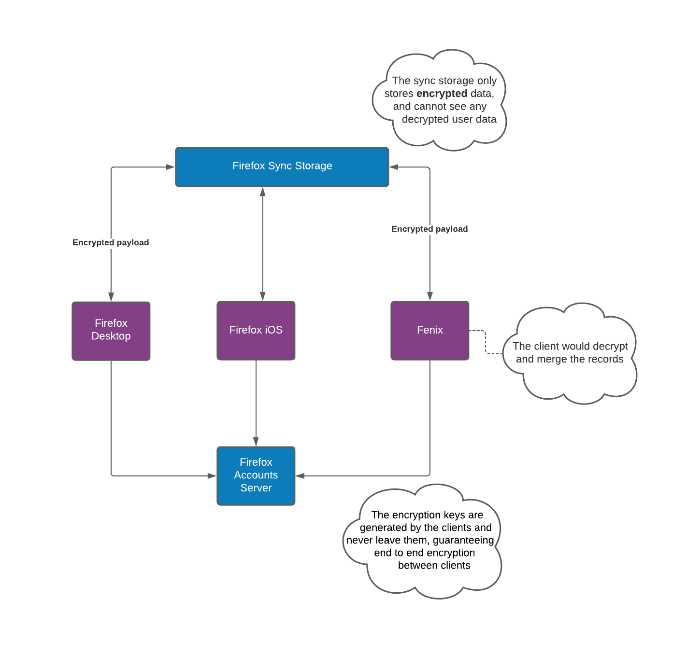
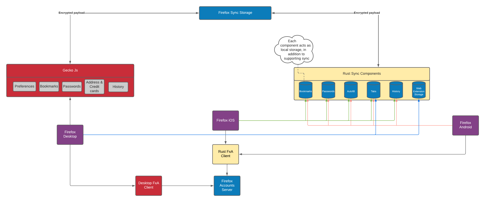

## High level firefox sync interactions
On a high level, Firefox Sync has three main components:
- The Firefox Account Server: Which uses oauth to authenticate and provide users with scoped access. The FxA Server also stores input that will 
    be used by the **clients** to generate the sync keys.
- Firefox: This is the firefox app itself, which implements the client logic to communicate with the firefox account servers, generate sync keys,
    use them to encrypt data and send/receive encrypted data to/from the sync 
    storage servers
- Sync Storage Server: The server that stores **encrypted** sync data. The clients would retrieve the encrypted data and decrypt
    it **client side**

Additionally, the token server assists in providing metadata to Firefox, so that it knows which sync server to communicate with.

## Multi-platform sync diagram
Since we have multiple Firefox apps (Desktop, iOS, Android, Focus, etc) Firefox sync can sync across platforms. Allowing users
to access their up-to-date data across apps and devices.

### Before: How sync was
Before our Rust Components came to life, each application had its own implementation of the sync and FxA client protocols.
This lead to duplicate logic across platforms. This was problematic since any modification to the sync or FxA client business logic
would need to be modified in all implementations and the likelihood of errors was high.

### Now: Sync is starting to streamline its components
Currently, we are in the process of migrating many of the sync implementation to use our Rust Component strategy.
Fenix primarily uses our Rust Components and iOS has some integrated as well. Additionally, Firefox Desktop also uses
one Rust component (Web Extension Storage).

The Rust components not only unify the different implementations of sync, they also provide a convenient local storage for the apps.
In other words, the apps can use the components for storage, with or without syncing to the server.

### Future: Only one implementation for each sync engine
In an aspirational future, all the applications would use the same implementation for Sync.
However, it's unlikely that we would migrate everything to use the Rust components since some implementations 
may not be prioritized, this is especially true for desktop which already has stable implementations.
That said, we can get close to this future and minimize duplicate logic and the likelihood of errors.

