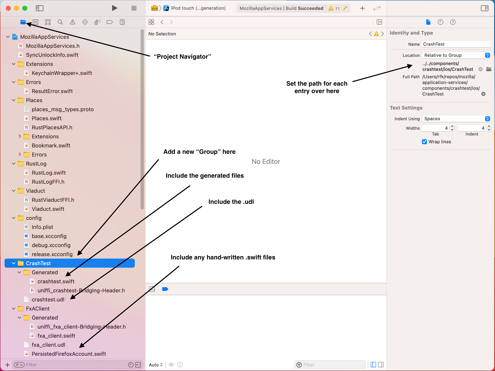
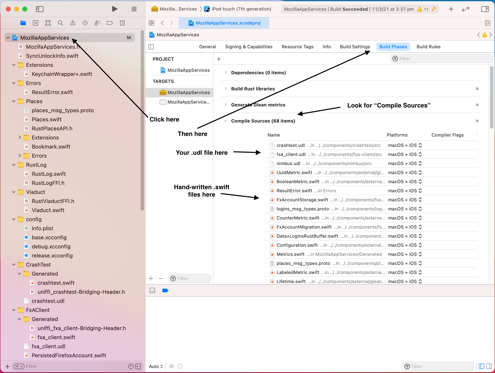
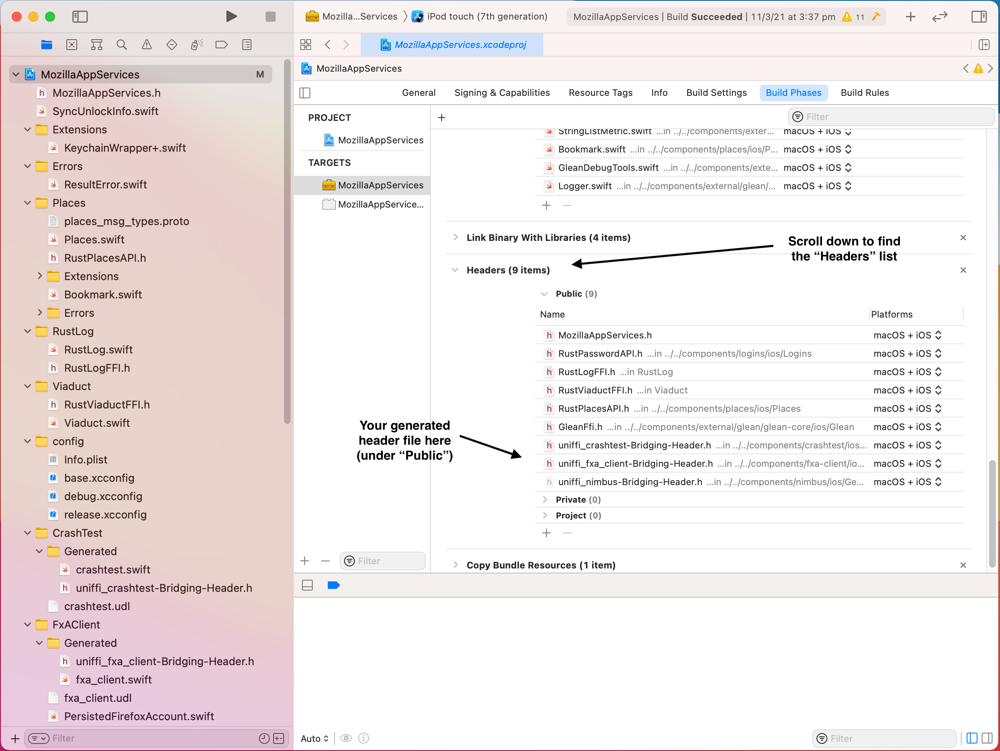
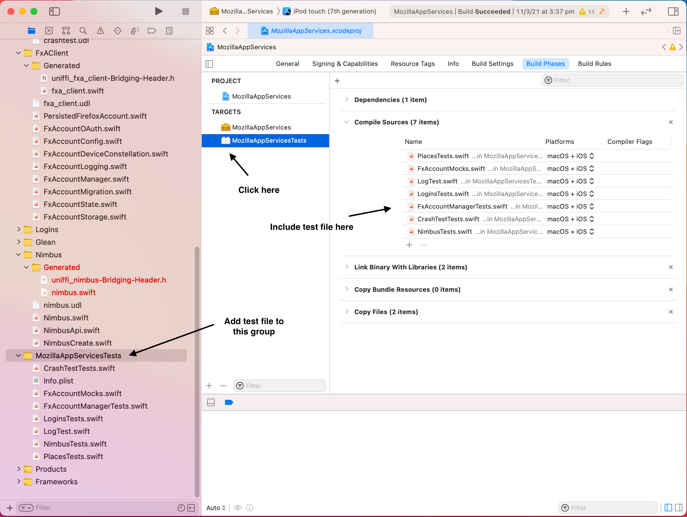

# Adding a new component to Application Services

Each component in the Application Services repository has three parts (the Rust code,
the Kotlin wrapper, and the Swift wrapper) so there are quite a few moving
parts involved in adding a new component. This is a rapid-fire list of all
the things you'll need to do if adding a new component from scratch.

## The Rust Code

Your component should live under `./components` in this repo.
Use `cargo new --lib ./components/<your_crate_name>`to create a new library crate,
and please try to avoid using hyphens in the crate name.

See the [Guide to Building a Rust Component](./building-a-rust-component.md) for general
advice on designing and structuring the actual Rust code, and follow the
[Dependency Management Guidelines](../dependency-management.md) if your crate
introduces any new dependencies.

Use [UniFFI](https://mozilla.github.io/uniffi-rs/) to define how your crate's
API will get exposed to foreign-language bindings. By convention, put the interface
definition file at `./components/<your_crate_name>/<your_crate_name>.udl`. Use
the `builtin-bindgen` feature of UniFFI to simplify the build process, by
putting the following in your `Cargo.toml`:

```
[build-dependencies]
uniffi_build = { version = "<latest version here>", features=["builtin-bindgen"] }
```

Include your new crate in the `application-services` workspace, by adding
it to the `members` and `default-members` lists in the `Cargo.toml` at
the root of the repository.

In order to be published to consumers, your crate must be included in the
["megazord"](../design/megazords.md) crate for each target platform:

* For Android, add it as a dependency in `./megazords/full/Cargo.toml` and
  add a `pub use <your_crate_name>` to `./megazords/full/src/lib.rs`.
* For iOS, add it as a dependency in `./megazords/ios-rust/rust/Cargo.toml` and
  add a `pub use <your_crate_name>` to `./megazords/ios-rust/src/lib.rs`.

Run `cargo check -p <your_crate_name>` in the repository root to confirm that
things are configured properly. This will also have the side-effect of updating
`Cargo.lock` to contain your new crate and its dependencies.


## The Kotlin Bindings

Make a `./components/<your_crate_name>/android` subdirectory to contain
Kotlin- and Android-specific code. This directory will contain a gradle
project for building your Kotlin bindings.

Copy the `build.gradle` file from `./components/crashtest/android/` into
your own component's directory, and edit it to replace the references to
`crashtest.udl` with your own component's `.udl` file.

Create a file `./components/<your_crate_name>/uniffi.toml` with the
following contents:

```toml
[bindings.kotlin]
package_name = "mozilla.appservices.<your_crate_name>"
cdylib_name = "megazord"
```

Create a file `./components/<your_crate_name>/android/src/main/AndroidManifest.xml`
with the following contents:

```xml
<manifest xmlns:android="http://schemas.android.com/apk/res/android"
    package="org.mozilla.appservices.<your_crate_name>" />
```

In the root of the repository, edit `.buildconfig-android.yml`to add
your component's metadata. This will cause it to be included in the
gradle workspace and in our build and publish pipeline. Check whether
it builds correctly by running:
* `./gradlew <your_crate_name>:assembleDebug`

You can include hand-written Kotlin code alongside the automatically
generated bindings, by placing `.kt`` files in a directory named:
* `./android/src/test/java/mozilla/appservices/<your_crate_name>/`

You can write Kotlin-level tests that consume your component's API,
by placing `.kt`` files in a directory named:
* `./android/src/test/java/mozilla/appservices/<your_crate_name>/`.

So you would end up with a directory structure something like this:

* `components/<your_crate_name>/`
    * `Cargo.toml`
    * `uniffi.toml`
    * `src/`
        * Rust code here.
    * `android/`
        * `build.gradle`
        * `src/`
          * `main/`
              * `AndroidManifest.xml`
              * `java/mozilla/appservices/<your_crate_name>/`
                  * Hand-written Kotlin code here.
          * `test/java/mozilla/appservices/<your_crate_name>/`
              * Kotlin test-cases here.

Run your component's Kotlin tests with `./gradlew <your_crate_name>:test`
to confirm that this is all working correctly.


## The Swift Bindings
### Creating the directory structure
Make a `./components/<your_crate_name>/ios` subdirectory to contain
Swift- and iOS-specific code. The UniFFI-generated swift bindings will
be written to a subdirectory named `Generated`.

You can include hand-written Swift code alongside the automatically
generated bindings, by placing `.swift` files in a directory named:
`./ios/<your_crate_name>/`.

So you would end up with a directory structure something like this:

* `components/<your_crate_name>/`
    * `Cargo.toml`
    * `uniffi.toml`
    * `src/`
        * Rust code here.
    * `ios/`
        * `<your_crate_name>/`
          * Hand-written Swift code here.
        * `Generated/`
          * Generated Swift code will be written into this directory.

### Adding your component to the Swift Package Manager Megazord
> *For more information on our how we ship components using the Swift Package Manager, check the [ADR that introduced the Swift Package Manager](../adr/0003-swift-packaging.md)*

You will need to do the following steps to include the component in the megazord:
1. Update its `uniffi.toml` to include the following settings:
    ```toml
    [bindings.swift]
    ffi_module_name = "MozillaRustComponents"
    ffi_module_filename = "<crate_name>FFI"
    ```
1. Add the component as a dependency to the `Cargo.toml` in [`megazords/ios-rust/`](https://github.com/mozilla/application-services/blob/main/megazords/ios-rust/Cargo.toml)
1. Add a `pub use` declaration for the component in [`megazords/ios-rust/src/lib.rs`](https://github.com/mozilla/application-services/blob/main/megazords/ios-rust/src/lib.rs)
1. Add logic to the [`megazords/ios-rust/build-xcframework.sh`](https://github.com/mozilla/application-services/blob/main/megazords/ios-rust/build-xcframework.sh) to copy or generate its header file into the build
1. Add an `#import` for its header file to [`megazords/ios-rust/MozillaRustComponents.h`](https://github.com/mozilla/application-services/blob/main/megazords/ios-rust/MozillaRustComponents.h) 

1. Add your component into the iOS ["megazord"](../design/megazords.md) through the Xcode project, which can only really by done using the Xcode application, which can only really be done if you're on a Mac.

    1. Open `megazords/ios-rust/MozillaTestServices.xcodeproj` in Xcode.

    1. In the Project navigator, add a new Group for your new component, pointing to
    the `./ios/` directory you created above. Add the following entries to the Group:
        * The `.udl` file for you component, from `../src/<your_crate_name>.udl`.
        * Any hand-written `.swift `files for your component
        * A sub-group named "Generated", pointing to the `./Generated/` subdirectory, and
          containing entries for the files generated by UniFFI:
            * `<your_crate_name>.swift`
            * `<your_crate_name>FFI.h`

The result should look something like this:



Click on the top-level "MozillaAppServices" project in the navigator,
then go to "Build Phases" and add `<your_crate_name>.udl` to the list
of "Compile Sources". This will trigger an Xcode Build Rule that generates
the Swift bindings automatically. Also include any hand-written `.swift` files
in this list.

The result should look something like this:



In the same "Build Phases" screen, under the "Headers" section, add `<your_crate_name>FFI.h` to the list of Public headers.
The result should look something like this:



Build the project in Xcode to check whether that all worked correctly.

To add Swift tests for your component API, create them in a file under
`megazords/ios-rust/MozillaTestServicesTests/`. Use this syntax to import
your component's bindings from the compiled megazord:

```
@testable import MozillaAppServices
```

In Xcode, navigate to the `MozillaTestServicesTests` Group and add your
new test file as an entry. Select the corresponding target, click on
"Build Phases", and add your test file to the list of "Compile Sources".
The result should look something like this:



Use the Xcode Test Navigator to run your tests and check whether
they're passing.

## Distribute your component with `rust-components-swift`

To distribute your component with `rust-components-swift`, you need to add logic for dynamically generating any swift code to the [`generate.sh` script in the `rust-components-swift` repo](https://github.com/mozilla/rust-components-swift/blob/main/generate.sh). You can use that script to:
    - Generate `uniffi` bindings
    - Generate `Glean` metrics
    - Copy over any handwritten code
