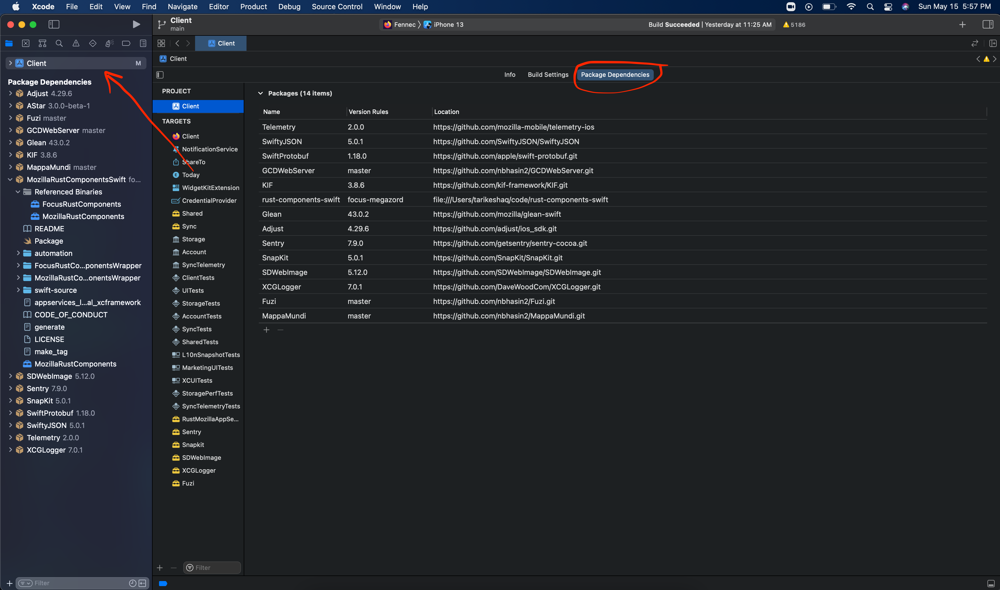

# How to locally test Swift Package Manager components on Firefox iOS
> This is a guide on testing the Swift Package Manager component locally against a local build of Firefox iOS. For more information on our Swift Package Manager design, read the [ADR that introduced it](../adr/0003-swift-packaging.md)

> This guide assumes the component you want to test is already distributed with the [`rust-components-swift`](https://github.com/mozilla/rust-components-swift) repository, you can read [the guide for adding a new component](./adding-a-new-component.md#including-the-component-in-the-swift-package-manager-megazord) if you would like to distribute a new component.


**The goal for this document is to be able to build a local firefox iOS against a local application-services**. On a high level, that requires the following:

1. Build an xcframework in a local checkout of `application-services`
1. Include the xcframework in a local checkout of `rust-components-swift`
1. Run the `generate` script in `rust-components-swift` using a local checkout of `application-services`
1. Include the local checkout of `rust-components-swift` in `firefox-ios`


## Prerequisites:
1. A local checkout of [`firefox-ios` that is ready to build](https://github.com/mozilla-mobile/firefox-ios#building-the-code)
1. A local checkout of [`rust-components-swift`](https://github.com/mozilla/rust-components-swift)
1. A local checkout of [`application-services` that is ready to build for iOS](../building.md#building-for-firefox-ios)

## Using the automated flow
For convenience, there is a script that will do all the necessary steps to configure your local `firefox-ios` build with a local `application-services` repository. You do **not** need to do the [manual steps](#using-the-manual-flow) if you follow those steps.

1. Run the following to execute the script, the example below assumes all of `firefox-ios`, `rust-components-swift` and `application-services` are in the same directory. Adjust the paths according to where they are on your filesystem.

    ```bash
    $ cd firefox-ios # This is your local checkout of firefox-ios
    $ ./rust_components_local.sh -a ../application-services ../rust-components-swift
    ```

1. Using Xcode, open `Client.xcodeproj` in `firefox-ios`

1. Then, make sure to reset packages cache in Xcode. This forces Xcode to remove any previously cached versions of the Rust components.
    - You can reset package caches by going to `File -> Packages -> Reset Package Caches`
1. If this is not the first time you run the script, make sure to also update package versions. This forces Xcode to pull the latest changes in the `rust-components-swift` branch.
    - You can update package versions by going to `File -> Packages -> Update To Latest Package Versions`
    - If this step fails, it's possible that the `Reset Package Caches` step above left some cruft behind. You can force this step by manually removing  `~/Library/Caches/org.swift.swiftpm` and `~/Library/Developer/Xcode/DerivedData/Client-{some-long-string}`
1. Once the above steps are done, attempt building firefox ios. If you face problems, feel free to [contact us](../index.md#contact-us)

### Disabling local development
The easiest way to disable local development is to simply revert any changes to `firefox-ios/Client.xcodeproj/project.pbxproj`.

However, if there are other changes to the file that you would like to preserve, you can use the same script. To use the same script, you will need to:
1. Know what version of `rust-components-swift` was used beforehand. You can find this by checking the git diff on `firefox-ios/Client.xcodeproj/project.pbxproj`.
1. Run:
    ```bash
    $ ./rust_components_local.sh --disable <VERSION> ../rust-components-swift
    ```
1. Then, make sure to reset packages cache in Xcode. This forces Xcode to remove any previously cached versions of the Rust components.
    - You can reset package caches by going to `File -> Packages -> Reset Package Caches`


> If you happen to change branches in `rust-components-swift`, you will need to disable then re-enable local development. The script is not currently smart enough to switch branches. Alternatively, keep the branch in `rust-components-swift` the same. `rust-components-swift` serves only as a release surface so there is little use to switching branches and pushing changes to it, unless you are changing something related to the release process.

## Using the manual flow
**It's important to note the automated flow runs through all the necessary steps in a script, so if possible use the script as it's a tedious manual process**

However, if the script is failing or you would like to run the manual process for any other reason follow the following steps.

### Building the xcframework
To build the [xcframework](https://developer.apple.com/documentation/swift_packages/distributing_binary_frameworks_as_swift_packages) do the following:
1. In your local checkout of `application-services`, navigate to [`megazords/ios-rust/`](https://github.com/mozilla/application-services/tree/main/megazords/ios-rust)
1. Run the `build-xcframework.sh` script:
```bash
$ ./build-xcframework.sh
```
This will produce a file name `MozillaRustComponents.xcframework.zip` that contains the following, built for all our target iOS platforms.
- The compiled Rust code for all the crates listed in `Cargo.toml` as a static library
- The C header files and [Swift module maps](https://clang.llvm.org/docs/Modules.html) for the components

### Include the xcframework in a local checkout of `rust-components-swift`
After you generated the `MozillaRustComponents.xcframework.zip` in the previous step, do the following to include it in a local checkout of `rust-components-swift`. The file will be in the `megazords/ios-rust` directory.
1. Unzip the `MozillaRustComponents.xcframework.zip` into the `rust-components-swift` repository: (Assuming you are in the root of the `rust-components-swift` directory and `application-services` is a neighbor directory)
    ```sh
     unzip -o ../application-services/megazords/ios-rust/MozillaRustComponents.xcframework.zip -d .
    ```
1. Change the `Package.swift`'s reference to the xcframework to point to the unzipped `MozillaRustComponents.xcframework` that was created in the previous step. You can do this by uncommenting the following line:
    ```swift
        path: "./MozillaRustComponents.xcframework"
    ```
    and commenting out the following lines:
    ```swift
        url: url,
        checksum: checksum,
    ```

### Run the generation script with a local checkout of application services
For this step, run the following script from inside the `rust-components-swift` repository (assuming that `application-services` is a neighboring directory to `rust-components-swift`).

```sh
./generate.sh ../application-services
```
Once that is done, **stage and commit** the changes the script ran. Xcode can only pick up committed changes.

### Include the local checkout of `rust-components-swift` in `firefox-ios`
This is the final step to include your local changes into `firefox-ios`. Do the following steps:
1. Open `Client.xcodeproj` in Xcode
1. Navigate to the Swift Packages in Xcode:

1. Remove the dependency on `rust-components-swift` as listed on Xcode, you can click the dependency then click the `-`
1. Add a new swift package by clicking the `+`:

    1. On the top right, enter the full path to your `rust-components-swift` checkout, preceded by `file://`. If you don't know what that is, run `pwd` in while in `rust-components-swift`. For example: `file:///Users/tarikeshaq/code/rust-components-swift`
    1. Change the branch to be the checked-out branch of rust-component-swift you have locally. This is what the dialog should look like:
    
    > Note: If Xcode prevents you from adding the dependency to reference a local package, you will need to manually modify the `Client.xcodeproj/project.pbxproj` and replace every occurrence of `https://github.com/mozilla/rust-components-swift` with the full path to your local checkout.
    1. Click `Add Package`
    1. Now include the packages you would like to include, choose `MozillaAppServices`
1. Finally, attempt to build firefox-ios, and if all goes well it should launch  with your code. If you face problems, feel free to [contact us](../index.md#contact-us)
