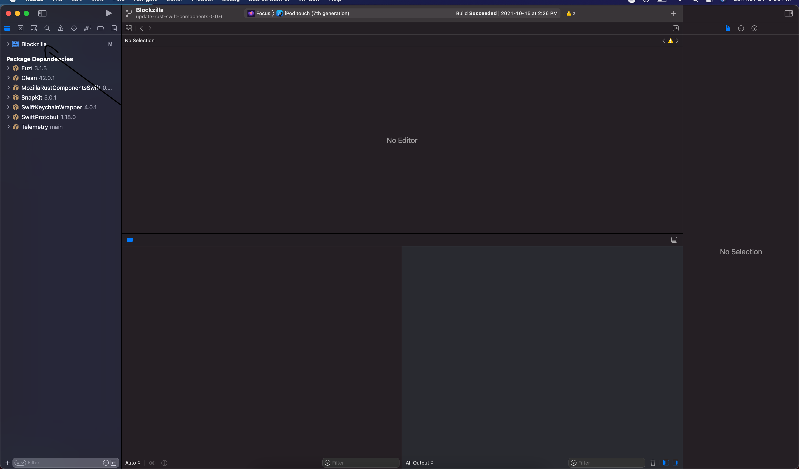

# How to locally test Swift Package Manager components on Focus iOS
> This is a guide on testing the Swift Package Manager component locally against a local build of Focus iOS. For more information on our Swift Package Manager design, read the [ADR that introduced it](../adr/0003-swift-packaging.md)

> This guide assumes the component you want to test is already distributed with the [`rust-components-swift`](https://github.com/mozilla/rust-components-swift) repository, you can read [the guide for adding a new component](./adding-a-new-component.md#including-the-component-in-the-swift-package-manager-megazord) if you would like to distribute a new component.

To test a component locally, you will need to do the following:
1. Build an xcframework in a local checkout of `application-services`
1. Include the xcframework in a local checkout of `rust-components-swift`
1. Run the `make-tag` script in `rust-components-swift` using a local checkout of `application-services`
1. Include the local checkout of `rust-components-swift` in `Focus`

Below are more detailed instructions for each step

## Building the xcframework
To build the [xcframework](https://developer.apple.com/documentation/swift_packages/distributing_binary_frameworks_as_swift_packages) do the following:
1. In a local checkout of `application-services`, navigate to [`megazords/ios-rust/`](https://github.com/mozilla/application-services/tree/main/megazords/ios-rust)
1. Run the `build-xcframework.sh` script:
```bash
$ ./build-xcframework.sh --focus
```

This will produce a file name `FocusRustComponents.xcframework.zip` in the `focus` directory that contains the following, built for all our target iOS platforms.
- The compiled Rust code for all the crates listed in `Cargo.toml` as a static library
- The C header files and [Swift module maps](https://clang.llvm.org/docs/Modules.html) for the components

## Include the xcframework in a local checkout of `rust-components-swift`
After you generated the `FocusRustComponents.xcframework.zip` in the previous step, do the following to include it in a local checkout of `rust-components-swift`:
1. clone a local checkout of `rust-components-swift`, **not** inside the `application-services` repository:
    ```sh
    git clone https://github.com/mozilla/rust-components.swift.git
    ```
1. Unzip the `FocusRustComponents.xcframework.zip` into the `rust-components-swift` repository: (Assuming you are in the root of the `rust-components-swift` directory and `application-services` is a neighbor directory)
    ```sh
     unzip -o ../application-services/megazords/ios-rust/focus/FocusRustComponents.xcframework.zip -d .
    ```
1. Change the `Package.swift`'s reference to the xcframework to point to the unzipped `FocusRustComponents.xcframework` that was created in the previous step. You can do this by uncommenting the following line:
    ```swift
        path: "./FocusRustComponents.xcframework"
    ```
    and commenting out the following lines:
    ```swift
        url: focusUrl,
        checksum: focusChecksum,
    ```

## Run the generation script with a local checkout of application services
For this step, run the following script from inside the `rust-components-swift` repository (assuming that `application-services` is a neighboring directory to `rust-components-swift`).

```sh
./generate.sh ../application-services
```
Once that is done, **stage and commit** the changes the script ran. Xcode can only pick up committed changes.

## Include the local checkout of `rust-components-swift` in `Focus`
This is the final step to include your local changes into `Focus`. Do the following steps:
1. Clone a local checkout of `Focus` if you haven't already. Make sure you also install the project dependencies, more information in their [build instructions](https://github.com/mozilla-mobile/focus-ios#build-instructions)
1. Open `Blockzilla.xcodeproj` in Xcode
1. Navigate to the Swift Packages in Xcode:


1. Remove the dependency on `rust-components-swift` as listed on Xcode, you can click the dependency then click the `-`
1. Add a new swift package by clicking the `+`:

    1. On the top right, enter the full path to your `rust-components-swift` checkout, preceded by `file://`. If you don't know what that is, run `pwd` in while in `rust-components-swift`. For example: `file:///Users/tarikeshaq/code/rust-components-swift`
    1. Change the branch to be the checked-out branch of rust-component-swift you have locally. This is what the dialog should look like:
    
    1. Click `Add Package`
    1. Now include the `FocusAppServices` library.
    > Note: If Xcode prevents you from adding the dependency to reference a local package, you will need to manually modify the `Blockzilla.xcodeproj/project.pbxproj` and replace every occurrence of `https://github.com/mozilla/rust-components-swift` with the full path to your local checkout.
1. Finally, attempt to build focus, and if all goes well it should launch  with your code. If you face any problems, feel free to [contact us](../index.md#contact-us)
