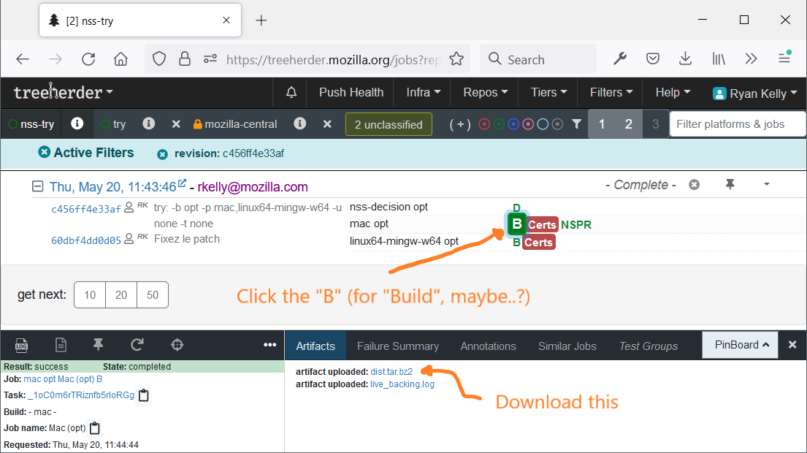

# Guide to upgrading NSS

Our components rely on cryptographic primitives provided by [NSS](https://developer.mozilla.org/docs/Mozilla/Projects/NSS).
Every month or so, a new version of NSS is [published](https://developer.mozilla.org/en-US/docs/Mozilla/Projects/NSS/NSS_Releases) and we should try to keep our version as up-to-date as possible.

Because it makes unit testing easier on Android, and helps startup performance on iOS, we compile NSS ourselves and link to it statically. Note that NSS is mainly used by Mozilla as a dynamic library and the NSS project is missing related CI jobs (iOS builds, windows cross-compile builds etc.) so you should expect breakage when updating the library (hence this guide).

## Updating the Version

The build code is located in the [`libs/`](https://github.com/mozilla/application-services/tree/main/libs) folder.

The version string is located in the beginning of [`build-all.sh`](https://github.com/mozilla/application-services/blob/b0b3daa6580d04906fc53e9e479e8bebb464cf78/libs/build-all.sh#L8-L11). For most NSS upgrades, the only action needed is to bump the version number in this file and update the downloaded archive checksum.  The actual build invocations are located in platform-specific script files (e.g. [`build-nss-ios.sh`](https://github.com/mozilla/application-services/blob/b0b3daa6580d04906fc53e9e479e8bebb464cf78/libs/build-nss-ios.sh)) but usually don't require any changes.

Due to the complexity of the NSS build process, we currently use pre-built artifacts
for running tests on MacOS and Win32 desktop machines (ref [#962](https://github.com/mozilla/application-services/issues/962)). You can regenerate these artifacts by taking advantage of the [NSS TryServer](https://wiki.mozilla.org/NSS:TryServer) infrastructure, with some patches to the NSS source:

1. Get the source for NSS:
    * `hg clone https://hg.mozilla.org/projects/nss`
    * `cd nss`
1. Apply [this patch](https://phabricator.services.mozilla.com/D30511) for Windows mingw build support, rebasing it on top
   of the release tag for the target NSS version:
    * `moz-phab patch --apply-to NSS_<X>_<YY>_RTM D30511`
1. Do your best to fix up any conflicts that may have resulted from the rebase, sorry :-(
    * The rejected hunks of the patch can be found with `find . -name "*.rej"`.
    * You will need to `hg commit -A` any manual changes before proceeding to the next step.
1. Apply the patch from [/libs/build-nss-static-libs.patch](../../libs/build-nss-static-libs.patch) to make the tryserver build static artifacts.
    * `hg patch ../application-services/libs/build-nss-static-libs.patch`
1. Do your best to fix up any conflicts that may have resulted from an outdated patch, sorry :-(
    * As above, you will need to `hg commit -A` any manual changes before proceeding to the next step.
1. Follow [these instructions](https://wiki.mozilla.org/NSS:TryServer#Pushing_to_nss-try) to push the resulting
   commit to try.
    * Confirm that all your changes have been committed.
    * Make sure you've added the `nss-try` path to your `.hg/hgrc` config.
    * Update the commit message to limit the number of jobs that are run.
        * `hg commit --amend --message "try: -b opt -p mac,linux64-mingw-w64 -u none -t none"`
    * `hg push -r . -f nss-try`
    * Visit the [tryserver dashboard](https://treeherder.mozilla.org/jobs?repo=nss-try) and find the resulting job.
      * If you can't find it, try adding `&author=you@mozilla.com` to the query string for filtering.
1. Once the build has completed, find the generated artifacts and download them.
    * The necessary UI looks like this:
      
    * For MacOS builds, download from the job named "mac opt".
    * For Windows builds, download from the job named "linux64-mingw-w64 opt".
    * Rename the files to `nss_nspr_static_<X>.<YY>_<darwin|mingw>.<ext>` following the pattern used by existing files.
1. Upload the resulting files to S3 at [https://fxa-dev-bucket.s3-us-west-2.amazonaws.com/a-s/](https://fxa-dev-bucket.s3-us-west-2.amazonaws.com/a-s/).
    * You'll need an account in the [Cloud Services AWS Dev Console](https://cloudservices-aws-dev.signin.aws.amazon.com/).
      Find out more on the [SVCOPS AWS Mana page](https://mana.mozilla.org/wiki/display/SVCOPS/AWS).

Once these files have been uploaded, update the URLs and corresponding checksums in
[build-nss-desktop.sh](https://github.com/mozilla/application-services/blob/bb5ff1b649bddae9bbd9157f4023304c467e388e/libs/build-nss-desktop.sh#L59-L74).

This process is far from optimal; [#962](https://github.com/mozilla/application-services/issues/962) tracks the work of further automating these steps.

To test out your changes:
  * Clear any old NSS build artifacts: `rm -rf ./libs/desktop && cargo clean`
  * Install the updates version: `./libs/verify-desktop-environment.sh`
  * Try it out: `cargo test`

## Exposing new functions

If the new version of NSS comes with new functions that you want to expose, you will need to:

* Add low-level bindings for those functions in the [`nss_sys` crate](
  ../../components/support/rc_crypto/nss/nss_sys); follow the instructions in
  README for that crate.
* Expose a safe wrapper API for the functions from the [`nss` crate](
  ../../components/support/rc_crypto/nss);
* Expose a convenient high-level API for the functions from the [`rc_crypto` crate](
  ../../components/support/rc_crypto);

## Tips for Fixing Bustage

On top of the primitives provided by NSS, we have built a safe Rust wrapper named [rc_crypto](https://github.com/mozilla/application-services/tree/main/components/support/rc_crypto) that links to NSS and makes these cryptographic primitives available to our components.

The linkage is done by the [`nss_build_common`](https://github.com/mozilla/application-services/blob/b0b3daa6580d04906fc53e9e479e8bebb464cf78/components/support/rc_crypto/nss/nss_build_common/src/lib.rs) crate. Note that it supports a `is_gecko` feature to link to NSS dynamically on Desktop.

Because the NSS static build process does not output a single `.a` file (it would be great if it did), this file must [describe](https://github.com/mozilla/application-services/blob/b0b3daa6580d04906fc53e9e479e8bebb464cf78/components/support/rc_crypto/nss/nss_build_common/src/lib.rs#L85-L133) for each architecture which modules should we link against. It is mostly a duplication of logic from the [NSS gyp build files](https://searchfox.org/nss/rev/d0ca572a63597a19889611c065273f131cc09b7a/lib/freebl/freebl.gyp#385-408). Note that this logic is also duplicated in our NSS lib build steps (e.g. [build-nss-desktop.sh](https://github.com/mozilla/application-services/blob/b0b3daa6580d04906fc53e9e479e8bebb464cf78/libs/build-nss-desktop.sh#L82-L114)).

One of the most common build failures we get when upgrading NSS comes from NSS adding new vectorized/asm versions of a crypto algorithm for a specific architecture in order to improve performance. This new optimized code gets implemented as a new gyp target/module that is emitted only for the supported architectures.
When we upgrade our copy of NSS we notice the linking step failing on CI jobs because of undefined symbols.

[This PR](https://github.com/mozilla/application-services/pull/2476) shows how we update `nss_common_build` and the build scripts to accommodate for these new modules. Checking the changelog for any suspect commit relating to hardware acceleration is rumored to help.
